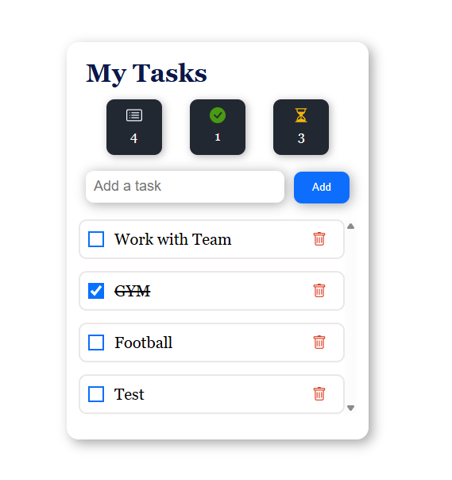

# To-Do List

This is a simple To-Do List application built with HTML, CSS, and JavaScript.

It allows users to create and manage daily tasks.

## Features

- Add new tasks
- Delete tasks
- Mark tasks as completed
- Display the number of completed tasks
- Save tasks in Local Storage
- Keep tasks saved after refreshing the page

## What I Learned

While building this project, I practiced:

- DOM manipulation
- Event handling
- JavaScript arrays and objects
- `forEach()`
- `findIndex()`
- `splice()`
- Working with checkboxes
- JSON `stringify()` and `parse()`
- Local Storage
- Re-rendering data after changes

## Screenshot

